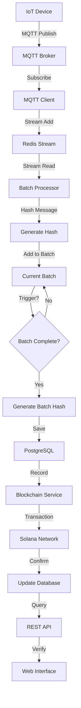

# Technical Guide: MQTT Bridge with Solana Blockchain Integration

## 📋 Table of Contents

1. [Overview](#overview)
2. [Blockchain Fundamentals for Developers](#blockchain-fundamentals)
3. [System Architecture](#system-architecture)
4. [Component Deep Dive](#component-deep-dive)
5. [Data Flow & Processing](#data-flow-processing)
6. [Security & Cryptography](#security-cryptography)
7. [API Reference](#api-reference)
8. [Database Schema](#database-schema)
9. [Configuration Guide](#configuration-guide)
10. [Deployment & Operations](#deployment-operations)
11. [Troubleshooting](#troubleshooting)
12. [Performance & Scaling](#performance-scaling)

---

## 1. Overview

### What is This System?

This system is an **IoT data integrity platform** that collects MQTT messages from devices and provides **cryptographic proof** that the data hasn't been tampered with using Solana blockchain technology.

```
IoT Sensors → MQTT → Our System → Database + Blockchain → Verification
```

### Key Benefits

- **Data Integrity**: Cryptographic proof that data hasn't been modified
- **Transparency**: Anyone can verify data authenticity on blockchain
- **Audit Trail**: Immutable record of all data batches
- **Scalability**: Handles high-volume IoT data streams
- **Cost-Effective**: Efficient batching reduces blockchain transaction costs

### Use Cases

1. **Manufacturing**: Verify sensor readings from production lines
2. **Supply Chain**: Prove authenticity of tracking data
3. **Environmental Monitoring**: Ensure weather/pollution data integrity
4. **Smart Cities**: Verify traffic, parking, utility data
5. **Healthcare**: Secure medical device readings

---

## 2. Blockchain Fundamentals for Developers

### What is Blockchain? (Simple Explanation)

Think of blockchain as a **digital ledger** that:

- Is **distributed** across many computers
- **Cannot be changed** once data is written
- Is **publicly verifiable** by anyone
- Uses **cryptography** to ensure security

### Why Solana?

| Feature     | Solana       | Ethereum      | Bitcoin        |
| ----------- | ------------ | ------------- | -------------- |
| Speed       | ~2000 TPS    | ~15 TPS       | ~7 TPS         |
| Cost        | ~$0.00025    | ~$5-50        | ~$1-10         |
| Finality    | ~1-2 seconds | ~1-15 minutes | ~10-60 minutes |
| Programming | Rust/C/C++   | Solidity      | Script         |

**For IoT data**, Solana is ideal because:

- ✅ **Low cost**: Can afford to record many batches
- ✅ **Fast**: Quick confirmation times
- ✅ **Scalable**: Handles high transaction volume

### Key Blockchain Concepts

#### Transaction

```json
{
  "signature": "3xS2...Kd5n", // Unique ID (like a receipt number)
  "from": "wallet_address", // Who sent it
  "instructions": [
    // What to do
    {
      "program": "memo", // Which program to use
      "data": "batch_info" // What data to store
    }
  ]
}
```

#### Wallet

- **Public Key**: Like your email address (shareable)
- **Private Key**: Like your password (keep secret!)
- **Balance**: How much SOL (currency) you have

#### Network Types

- **Devnet**: Free testing environment (fake money)
- **Testnet**: More realistic testing
- **Mainnet**: Real production network (real money)

---

## 3. System Architecture

### High-Level Architecture

```
┌─────────────┐    ┌──────────────┐    ┌─────────────┐
│ IoT Devices │───▶│ MQTT Broker  │───▶│ Bridge App  │
└─────────────┘    └──────────────┘    └─────────────┘
                                              │
                   ┌─────────────────────────┼─────────────────────────┐
                   │                         │                         │
                   ▼                         ▼                         ▼
            ┌─────────────┐          ┌─────────────┐          ┌─────────────┐
            │ Redis       │          │ PostgreSQL  │          │ Solana      │
            │ (Queue)     │          │ (Database)  │          │ (Blockchain)│
            └─────────────┘          └─────────────┘          └─────────────┘
                                              │
                                              ▼
                                    ┌─────────────┐
                                    │ REST API    │
                                    │ + Web UI    │
                                    └─────────────┘
```

### Technology Stack

| Layer              | Technology        | Purpose                    |
| ------------------ | ----------------- | -------------------------- |
| **Message Broker** | Mosquitto MQTT    | Receive IoT messages       |
| **Queue**          | Redis Streams     | Reliable message buffering |
| **Application**    | Node.js + Express | Core processing logic      |
| **Database**       | PostgreSQL        | Message and batch storage  |
| **Blockchain**     | Solana            | Immutable proof storage    |
| **Cryptography**   | SHA-256           | Message/batch hashing      |

### Service Components

```
┌─────────────────┐
│   Application   │
├─────────────────┤
│ MQTT Client     │ ← Subscribes to MQTT topics
│ Batch Processor │ ← Groups messages into batches
│ Blockchain Svc  │ ← Records to Solana
│ Storage Service │ ← Saves to PostgreSQL
│ API Server      │ ← Exposes REST endpoints
└─────────────────┘
```

---

## 4. Component Deep Dive

### 4.1 MQTT Client (`src/clients/mqtt.js`)

**Purpose**: Subscribe to IoT device messages

```javascript
// Subscribes to topics like: mqtt/things/device-123/temperature
const mqttClient = mqtt.connect("mqtt://broker:1883", {
  username: "bridge",
  password: "bridge123",
});

mqttClient.subscribe("mqtt/things/#"); // # = wildcard for all devices
```

**Message Format**:

```json
{
  "topic": "mqtt/things/device-123/temperature",
  "payload": {
    "value": 25.5,
    "unit": "celsius",
    "timestamp": 1696204800000
  },
  "receivedAt": "2025-10-02T10:30:00.000Z"
}
```

### 4.2 Batch Processor (`src/services/batchProcessor.js`)

**Purpose**: Group messages into batches for efficient blockchain storage

**Why Batching?**

- Individual blockchain transactions are expensive
- Batching 1000 messages into 1 transaction reduces costs by 1000x
- Maintains cryptographic integrity through batch hashing

```javascript
class BatchProcessor {
  constructor() {
    this.batch = {
      id: randomUUID(), // Unique batch identifier
      messages: [], // Array of messages
      messageHashes: [], // Array of message hashes
      messageCount: 0, // Total messages in batch
      startTimestamp: null, // When first message was received
      endTimestamp: null, // When batch was completed
    };
  }

  async completeBatch() {
    // 1. Calculate batch hash
    const batchHash = generateBatchHash(this.batch);

    // 2. Save to database
    await saveBatch(this.batch, batchHash);

    // 3. Record to blockchain (non-blocking)
    if (cfg.solana.enabled) {
      blockchainService
        .recordBatchWithFallback(this.batch.id, this.batch.messageCount)
        .catch((err) => {
          // Will be retried by retry worker
          logger.warn({
            msg: "Blockchain recording queued for retry",
            batchId: this.batch.id,
          });
        });
    }
  }
}
```

**Batch Triggers**:

1. **Size limit**: When batch reaches 1000 messages (configurable)
2. **Time limit**: Every 5 minutes (configurable)

### 4.3 Hash Generator (`src/services/hashGenerator.js`)

**Purpose**: Create cryptographic fingerprints for integrity verification

```javascript
// Message Hash (for individual messages)
function generateMessageHash(message) {
  const data = `${message.deviceId}|${message.timestamp}|${JSON.stringify(
    message.payload
  )}`;
  return crypto.createHash("sha256").update(data).digest("hex");
}

// Batch Hash (for entire batch)
function generateBatchHash(batch) {
  const data = batch.messageHashes.sort().join("|"); // Sort for deterministic hash
  return crypto.createHash("sha256").update(data).digest("hex");
}
```

**Hash Properties**:

- **Deterministic**: Same input always produces same hash
- **Avalanche Effect**: Tiny change in input creates completely different hash
- **One-way**: Cannot reverse hash to get original data
- **Fixed Length**: Always 64 characters (256 bits)

### 4.4 Solana Client (`src/clients/solana.js`)

**Purpose**: Interface with Solana blockchain

```javascript
class SolanaClient {
  async initialize() {
    // 1. Connect to Solana RPC
    this.connection = new Connection(config.solana.rpcUrl);

    // 2. Load wallet from private key
    this.keypair = Keypair.fromSecretKey(bs58.decode(config.solana.privateKey));

    // 3. Check connection and balance
    const balance = await this.connection.getBalance(this.keypair.publicKey);
    if (balance < 0.1 * LAMPORTS_PER_SOL) {
      throw new Error("Wallet balance too low");
    }
  }

  async recordBatch(batchId, messageCount, batchHash) {
    // Create memo instruction with batch data
    const memoData = {
      type: "VEEP_BATCH",
      version: "1.0",
      batchId,
      batchHash,
      messageCount,
      timestamp: new Date().toISOString(),
    };

    const transaction = new Transaction().add(
      new TransactionInstruction({
        keys: [],
        programId: MEMO_PROGRAM_ID,
        data: Buffer.from(JSON.stringify(memoData), "utf8"),
      })
    );

    // Send transaction
    const signature = await sendAndConfirmTransaction(
      this.connection,
      transaction,
      [this.keypair]
    );

    return signature;
  }
}
```

**Why Memo Program?**

- Built-in Solana program for storing arbitrary data
- No deployment needed
- Low cost (~5000 lamports = ~$0.00001)
- Data is publicly readable

### 4.5 Blockchain Service (`src/services/blockchainService.js`)

**Purpose**: Orchestrate blockchain operations with retry logic

```javascript
class BlockchainService {
  async recordBatchWithFallback(batchId, messageCount) {
    try {
      // 1. Record to blockchain
      const signature = await this.solanaClient.recordBatch(
        batchId,
        messageCount,
        batchHash
      );

      // 2. Update database with success
      await this.updateBatchSolanaStatus(batchId, "confirmed", signature);

      this.stats.totalSuccess++;
      return signature;
    } catch (error) {
      // 3. Add to retry queue on failure
      await this.addToRetryQueue(batchId, error.message);
      this.stats.totalFailures++;
      throw error;
    }
  }

  async startRetryWorker() {
    // Run every 5 minutes
    this.retryWorker = setInterval(async () => {
      await this.processRetryQueue();
    }, config.blockchain.retryIntervalMs);
  }

  async processRetryQueue() {
    // Get all pending batches
    const pendingBatches = await this.getPendingBatches();

    for (const batch of pendingBatches) {
      try {
        // Retry recording
        const signature = await this.solanaClient.recordBatch(
          batch.batch_id,
          batch.message_count,
          batch.batch_hash
        );

        // Update status on success
        await this.updateBatchSolanaStatus(
          batch.batch_id,
          "confirmed",
          signature
        );
      } catch (error) {
        // Increment retry count
        await this.incrementRetryCount(batch.batch_id, error.message);
      }
    }
  }
}
```

**Retry Strategy**:

- **Interval**: Every 5 minutes
- **Max Retries**: 10 attempts
- **Backoff**: Exponential (could be added)
- **Failure Handling**: Mark as failed after max retries

---

## 5. Data Flow & Processing

### Complete Message Journey

```
1. IoT Device Publishes Message
   ↓
2. MQTT Client Receives Message
   ↓
3. Message Added to Redis Stream
   ↓
4. Batch Processor Reads from Stream
   ↓
5. Message Hash Generated
   ↓
6. Message Added to Current Batch
   ↓
7. Batch Complete? (Size/Time Trigger)
   ↓
8. Batch Hash Generated
   ↓
9. Batch Saved to PostgreSQL
   ↓
10. Blockchain Service Records to Solana
   ↓
11. Database Updated with Transaction Signature
   ↓
12. Batch Available via API for Verification
```

### Detailed Flow Diagram



### Error Handling Flow

```
Normal Flow:     Message → Batch → Database → Blockchain → ✅
                                     ↓
Error Flow:      Message → Batch → Database → Blockchain → ❌
                                                    ↓
Retry Flow:      Retry Worker → Get Pending → Retry Blockchain → ✅/❌
                                                    ↓
Final State:     Max Retries Reached → Mark as Failed → Alert
```

---

## 6. Security & Cryptography

### 6.1 Cryptographic Hash Functions

**SHA-256 Properties**:

```javascript
// Example: Tiny change creates completely different hash
sha256("Hello World"); // "a591a6d40bf420404a011733cfb7b190d62c65bf0bcda32b57b277d9ad9f146e"
sha256("Hello world"); // "64ec88ca00b268e5ba1a35678a1b5316d212f4f366b2477232534a8aeca37f3c"
```

**Message Integrity Chain**:

1. **Device Data** → Hash → **Message Hash**
2. **All Message Hashes** → Hash → **Batch Hash**
3. **Batch Hash** → Blockchain → **Immutable Record**

### 6.2 Blockchain Security

**Public Key Cryptography**:

```
Private Key (Secret) → Public Key (Shareable) → Wallet Address
```

**Transaction Signing**:

```javascript
// Only holder of private key can create valid signature
const transaction = new Transaction();
transaction.sign(keypair); // Uses private key
// Network verifies using public key
```

**Immutability Guarantee**:

- Once on blockchain, data **cannot be changed**
- Changing data would require **51% network control** (virtually impossible on Solana)
- All nodes have **identical copy** of data

### 6.3 Security Best Practices

**Private Key Management**:

```bash
# ❌ Bad: Store in code
const privateKey = "5J1F7GHai1Vb6..."

# ✅ Good: Environment variable
const privateKey = process.env.SOLANA_PRIVATE_KEY

# ✅ Better: External vault
const privateKey = await vault.getSecret("solana-key")
```

**Network Security**:

- **TLS/SSL**: All connections encrypted
- **Authentication**: MQTT broker requires credentials
- **Firewall**: Database access restricted
- **Rate Limiting**: API endpoints protected

---

## 7. API Reference

### 7.1 Health & Monitoring

#### `GET /health`

Basic service health check

```bash
curl http://localhost:3000/health
```

**Response**:

```json
{
  "status": "healthy",
  "timestamp": "2025-10-02T10:30:00.000Z",
  "version": "2.0.0"
}
```

#### `GET /api/v1/blockchain/health`

Detailed blockchain health status

```bash
curl http://localhost:3000/api/v1/blockchain/health
```

**Response**:

```json
{
  "healthy": true,
  "solana": {
    "healthy": true,
    "rpc": {
      "connected": true,
      "blockHeight": 399699276,
      "url": "https://api.devnet.solana.com"
    },
    "wallet": {
      "publicKey": "HgMJvtdEahtFwDX8pqFWYAegNST27xKmDDAUsSEhGBKa",
      "balance": 1.99985,
      "balanceStatus": "ok"
    }
  },
  "retryWorkerRunning": true,
  "isProcessingRetries": false
}
```

**Health Status Meanings**:

- `healthy: true` - All systems operational
- `balance > 0.1 SOL` - Sufficient funds for transactions
- `retryWorkerRunning: true` - Retry mechanism active

#### `GET /metrics`

Prometheus metrics for monitoring

```bash
curl http://localhost:3000/metrics
```

**Key Metrics**:

```
# HELP mqtt_messages_received_total Total MQTT messages received
mqtt_messages_received_total 1234567

# HELP batches_completed_total Total batches completed
batches_completed_total 1234

# HELP blockchain_attempts_total Blockchain recording attempts
blockchain_attempts_total 1200

# HELP blockchain_success_total Successful blockchain recordings
blockchain_success_total 1180
```

### 7.2 Batch Operations

#### `GET /api/v1/batches`

List batches with pagination

```bash
curl "http://localhost:3000/api/v1/batches?limit=10&offset=0"
```

**Parameters**:

- `limit` - Number of results (default: 20, max: 100)
- `offset` - Skip results (for pagination)

**Response**:

```json
[
  {
    "batch_id": "550e8400-e29b-41d4-a716-446655440000",
    "message_count": 1000,
    "batch_hash": "a1b2c3d4e5f6...",
    "start_timestamp": "2025-10-02T10:00:00.000Z",
    "end_timestamp": "2025-10-02T10:05:00.000Z",
    "created_at": "2025-10-02T10:05:01.000Z"
  }
]
```

#### `GET /api/v1/batches/:id`

Get specific batch details

```bash
curl http://localhost:3000/api/v1/batches/550e8400-e29b-41d4-a716-446655440000
```

**Response**:

```json
{
  "batch_id": "550e8400-e29b-41d4-a716-446655440000",
  "message_count": 1000,
  "batch_hash": "a1b2c3d4e5f6...",
  "start_timestamp": "2025-10-02T10:00:00.000Z",
  "end_timestamp": "2025-10-02T10:05:00.000Z",
  "created_at": "2025-10-02T10:05:01.000Z",
  "messages": [
    {
      "message_id": "msg-123",
      "topic": "mqtt/things/device-1/temperature",
      "payload": { "temperature": 25.5 },
      "received_at": "2025-10-02T10:00:01.000Z",
      "device_id": "device-1",
      "hash": "message_hash_here"
    }
  ]
}
```

### 7.3 Blockchain Operations

#### `GET /api/v1/blockchain/stats`

Blockchain service statistics

```bash
curl http://localhost:3000/api/v1/blockchain/stats
```

**Response**:

```json
{
  "enabled": true,
  "totalAttempts": 150,
  "totalSuccess": 142,
  "totalFailures": 8,
  "successRate": "94.67%",
  "pendingRetries": 2,
  "lastSuccess": "2025-10-02T10:25:00.000Z",
  "lastError": "RPC timeout"
}
```

#### `GET /api/v1/blockchain/batches/:id`

Get batch blockchain information

```bash
curl http://localhost:3000/api/v1/blockchain/batches/550e8400-e29b-41d4-a716-446655440000
```

**Response**:

```json
{
  "batchId": "550e8400-e29b-41d4-a716-446655440000",
  "messageCount": 1000,
  "batchHash": "a1b2c3d4e5f6...",
  "createdAt": "2025-10-02T10:05:01.000Z",
  "blockchain": {
    "enabled": true,
    "network": "devnet",
    "status": "confirmed",
    "signature": "3Q1VgzixJwtEvgmXYBwf5j8B6QtDxn6ozEeALigpRj4q...",
    "confirmedAt": "2025-10-02T10:05:15.000Z",
    "retryCount": 0,
    "lastError": null,
    "explorerUrl": "https://explorer.solana.com/tx/3Q1VgzixJwtEvgmXYBwf5j8B6QtDxn6ozEeALigpRj4q...?cluster=devnet"
  }
}
```

**Blockchain Status Values**:

- `pending` - Not yet recorded to blockchain
- `sent` - Transaction submitted, waiting confirmation
- `confirmed` - Successfully recorded and confirmed
- `failed` - Failed after max retries
- `skipped` - Blockchain disabled

#### `GET /api/v1/blockchain/verify/:id`

Verify batch integrity on blockchain

```bash
curl http://localhost:3000/api/v1/blockchain/verify/550e8400-e29b-41d4-a716-446655440000
```

**Response (Success)**:

```json
{
  "verified": true,
  "signature": "3Q1VgzixJwtEvgmXYBwf5j8B6QtDxn6ozEeALigpRj4q...",
  "explorerUrl": "https://explorer.solana.com/tx/3Q1VgzixJwtEvgmXYBwf5j8B6QtDxn6ozEeALigpRj4q...?cluster=devnet",
  "matches": {
    "batchId": true,
    "messageCount": true,
    "batchHash": true
  },
  "onChain": {
    "batchId": "550e8400-e29b-41d4-a716-446655440000",
    "messageCount": 1000,
    "batchHash": "a1b2c3d4e5f6..."
  },
  "database": {
    "batchId": "550e8400-e29b-41d4-a716-446655440000",
    "messageCount": 1000,
    "batchHash": "a1b2c3d4e5f6..."
  },
  "confirmedAt": "2025-10-02T10:05:15.000Z"
}
```

**Response (Pending)**:

```json
{
  "verified": false,
  "message": "Batch not yet recorded on blockchain",
  "status": "pending",
  "lastError": null
}
```

**Response (Failed)**:

```json
{
  "verified": false,
  "error": "Data mismatch detected",
  "matches": {
    "batchId": true,
    "messageCount": false,
    "batchHash": true
  }
}
```

### 7.4 Web Interface

#### `GET /verify?batchId=:id`

Interactive verification page

```bash
open "http://localhost:3000/verify?batchId=550e8400-e29b-41d4-a716-446655440000"
```

**Features**:

- Real-time verification
- Status indicators (✅ Verified, ⏳ Pending, ❌ Failed)
- Direct links to Solana Explorer
- Responsive design for mobile/desktop

---

## 8. Database Schema

### 8.1 Messages Table

```sql
CREATE TABLE messages (
    message_id VARCHAR(255) PRIMARY KEY,
    batch_id UUID NOT NULL,
    topic VARCHAR(500) NOT NULL,
    payload JSONB NOT NULL,
    received_at TIMESTAMP NOT NULL,
    tenant_id VARCHAR(255),
    site_id VARCHAR(255),
    device_id VARCHAR(255),
    hash VARCHAR(64) NOT NULL,
    created_at TIMESTAMP DEFAULT NOW()
);

-- Indexes for performance
CREATE INDEX idx_messages_batch_id ON messages(batch_id);
CREATE INDEX idx_messages_device_id ON messages(device_id);
CREATE INDEX idx_messages_received_at ON messages(received_at);
```

### 8.2 Batches Table

```sql
CREATE TABLE batches (
    batch_id UUID PRIMARY KEY,
    message_count INTEGER NOT NULL,
    batch_hash VARCHAR(64) NOT NULL,
    start_timestamp TIMESTAMP NOT NULL,
    end_timestamp TIMESTAMP NOT NULL,
    created_at TIMESTAMP DEFAULT NOW(),

    -- Solana blockchain columns
    solana_tx_signature VARCHAR(88),
    solana_status VARCHAR(20) DEFAULT 'pending',
    solana_retry_count INTEGER DEFAULT 0,
    solana_last_error TEXT,
    solana_confirmed_at TIMESTAMP
);

-- Indexes for blockchain operations
CREATE INDEX idx_batches_solana_status ON batches(solana_status);
CREATE INDEX idx_batches_solana_pending ON batches(solana_status) WHERE solana_status = 'pending';
CREATE INDEX idx_batches_created_at ON batches(created_at);
```

### 8.3 Schema Migration

**Migration File**: `scripts/migrations/003_add_solana_columns.sql`

```sql
-- Add Solana blockchain columns to existing batches table
ALTER TABLE batches ADD COLUMN IF NOT EXISTS solana_tx_signature VARCHAR(88);
ALTER TABLE batches ADD COLUMN IF NOT EXISTS solana_status VARCHAR(20) DEFAULT 'pending';
ALTER TABLE batches ADD COLUMN IF NOT EXISTS solana_retry_count INTEGER DEFAULT 0;
ALTER TABLE batches ADD COLUMN IF NOT EXISTS solana_last_error TEXT;
ALTER TABLE batches ADD COLUMN IF NOT EXISTS solana_confirmed_at TIMESTAMP;

-- Create indexes for efficient queries
CREATE INDEX IF NOT EXISTS idx_batches_solana_status ON batches(solana_status);
CREATE INDEX IF NOT EXISTS idx_batches_solana_pending ON batches(solana_status) WHERE solana_status = 'pending';
```

**Apply Migration**:

```bash
./scripts/devnet.sh node -e "
const { getPool } = require('./src/clients/database');
const fs = require('fs');
(async () => {
  const pool = getPool();
  const sql = fs.readFileSync('scripts/migrations/003_add_solana_columns.sql', 'utf8');
  await pool.query(sql);
  console.log('Migration applied successfully');
  await pool.end();
})();
"
```

### 8.4 Query Examples

**Get recent batches with blockchain status**:

```sql
SELECT
    batch_id,
    message_count,
    batch_hash,
    created_at,
    solana_status,
    solana_tx_signature,
    solana_confirmed_at
FROM batches
ORDER BY created_at DESC
LIMIT 10;
```

**Get pending blockchain records**:

```sql
SELECT batch_id, message_count, batch_hash, solana_retry_count
FROM batches
WHERE solana_status = 'pending'
    AND solana_retry_count < 10
ORDER BY created_at ASC;
```

**Calculate success rate**:

```sql
SELECT
    COUNT(*) as total_batches,
    COUNT(CASE WHEN solana_status = 'confirmed' THEN 1 END) as confirmed_batches,
    ROUND(
        COUNT(CASE WHEN solana_status = 'confirmed' THEN 1 END) * 100.0 / COUNT(*),
        2
    ) as success_rate_percent
FROM batches
WHERE created_at >= NOW() - INTERVAL '24 hours';
```

---

## 9. Configuration Guide

### 9.1 Environment Variables

**Core Configuration** (`.env`):

```bash
# Application
NODE_ENV=production
API_PORT=3000

# MQTT Broker
MQTT_HOST=mqtt://mosquitto:1883
MQTT_USER=bridge
MQTT_PASS=bridge123
MQTT_TOPIC_FILTER=mqtt/things/#
MQTT_QOS=1

# Redis (Message Queue)
REDIS_URL=redis://redis:6379
REDIS_STREAM=mqtt:messages
REDIS_GROUP=bridge
REDIS_CONSUMER=consumer-unique-id

# PostgreSQL Database
POSTGRES_HOST=postgres
POSTGRES_PORT=5432
POSTGRES_DB=mqtt
POSTGRES_USER=mqtt
POSTGRES_PASSWORD=mqtt
POSTGRES_SSL=false

# Batch Processing
BATCH_SIZE=1000                    # Messages per batch
BATCH_TIMEOUT_MS=300000            # 5 minutes in milliseconds

# Solana Blockchain
SOLANA_ENABLED=true                # Enable/disable blockchain features
SOLANA_RPC_URL=https://api.devnet.solana.com
SOLANA_NETWORK=devnet              # devnet/testnet/mainnet-beta
SOLANA_PRIVATE_KEY=base58-encoded-private-key

# Blockchain Service
BLOCKCHAIN_RETRY_INTERVAL_MS=300000  # 5 minutes
BLOCKCHAIN_MAX_RETRIES=10
```

**Development Configuration** (`.env.devnet`):

```bash
# Development-specific settings
NODE_ENV=development
SOLANA_RPC_URL=https://api.devnet.solana.com
SOLANA_NETWORK=devnet
SOLANA_PRIVATE_KEY=your-devnet-private-key-here
```

**Production Configuration** (`.env.production`):

```bash
# Production-specific settings
NODE_ENV=production
SOLANA_RPC_URL=https://api.mainnet-beta.solana.com
SOLANA_NETWORK=mainnet-beta
SOLANA_PRIVATE_KEY=your-mainnet-private-key-here

# Use stronger passwords
POSTGRES_PASSWORD=strong-random-password
MQTT_PASS=strong-random-password

# SSL enabled
POSTGRES_SSL=true
```

### 9.2 Configuration Object (`src/config/index.js`)

```javascript
const cfg = {
  env: process.env.NODE_ENV || "development",

  api: {
    port: parseInt(process.env.API_PORT || "3000", 10),
  },

  mqtt: {
    host: process.env.MQTT_HOST || "mqtt://mosquitto:1883",
    username: process.env.MQTT_USER || undefined,
    password: process.env.MQTT_PASS || undefined,
    topicFilter: process.env.MQTT_TOPIC_FILTER || "mqtt/things/#",
    clientIdPrefix: process.env.MQTT_CLIENT_PREFIX || "bridge-service-",
    qos: parseInt(process.env.MQTT_QOS || "1", 10),
  },

  redis: {
    url: process.env.REDIS_URL || "redis://redis:6379",
    stream: process.env.REDIS_STREAM || "mqtt:messages",
    group: process.env.REDIS_GROUP || "bridge",
    consumer:
      process.env.REDIS_CONSUMER ||
      `consumer-${Math.random().toString(16).slice(2)}`,
  },

  db: {
    host: process.env.POSTGRES_HOST || "postgres",
    port: parseInt(process.env.POSTGRES_PORT || "5432", 10),
    database: process.env.POSTGRES_DB || "mqtt",
    user: process.env.POSTGRES_USER || "mqtt",
    password: process.env.POSTGRES_PASSWORD || "mqtt",
    ssl: Boolean(process.env.POSTGRES_SSL) || false,
  },

  batching: {
    size: parseInt(process.env.BATCH_SIZE || "1000", 10),
    timeoutMs: parseInt(
      process.env.BATCH_TIMEOUT_MS || String(5 * 60 * 1000),
      10
    ),
  },

  solana: {
    rpcUrl: process.env.SOLANA_RPC_URL || "https://api.devnet.solana.com",
    privateKey: process.env.SOLANA_PRIVATE_KEY,
    network: process.env.SOLANA_NETWORK || "devnet",
    enabled: Boolean(process.env.SOLANA_ENABLED !== "false"), // Default enabled
  },

  blockchain: {
    retryIntervalMs: parseInt(
      process.env.BLOCKCHAIN_RETRY_INTERVAL_MS || String(5 * 60 * 1000),
      10
    ),
    maxRetries: parseInt(process.env.BLOCKCHAIN_MAX_RETRIES || "10", 10),
  },
};

module.exports = cfg;
```

### 9.3 Network-Specific Configurations

#### Devnet (Development)

```bash
SOLANA_RPC_URL=https://api.devnet.solana.com
SOLANA_NETWORK=devnet
# Free SOL from faucet, transactions are free
```

#### Testnet (Staging)

```bash
SOLANA_RPC_URL=https://api.testnet.solana.com
SOLANA_NETWORK=testnet
# More realistic testing, still free SOL
```

#### Mainnet (Production)

```bash
SOLANA_RPC_URL=https://api.mainnet-beta.solana.com
# Or paid provider: https://api.alchemy.com/v2/your-api-key
SOLANA_NETWORK=mainnet-beta
# Real SOL required, ~$0.00025 per transaction
```

### 9.4 Tuning Parameters

**Batch Size Optimization**:

```bash
# Small batches (faster processing, higher costs)
BATCH_SIZE=100
BATCH_TIMEOUT_MS=60000    # 1 minute

# Large batches (slower processing, lower costs)
BATCH_SIZE=5000
BATCH_TIMEOUT_MS=600000   # 10 minutes

# Recommended for IoT
BATCH_SIZE=1000
BATCH_TIMEOUT_MS=300000   # 5 minutes
```

**Retry Configuration**:

```bash
# Aggressive retry (for critical data)
BLOCKCHAIN_RETRY_INTERVAL_MS=60000    # 1 minute
BLOCKCHAIN_MAX_RETRIES=20

# Conservative retry (for cost optimization)
BLOCKCHAIN_RETRY_INTERVAL_MS=900000   # 15 minutes
BLOCKCHAIN_MAX_RETRIES=5
```

---

## 10. Deployment & Operations

### 10.1 Local Development Setup

```bash
# 1. Clone repository
git clone <repository-url>
cd mqtt-blockchain

# 2. Install dependencies
npm install

# 3. Setup environment
cp .env.devnet .env

# 4. Generate wallet (if needed)
node scripts/generate-wallet.js

# 5. Request devnet SOL
node scripts/request-airdrop.js

# 6. Start infrastructure
docker-compose up -d

# 7. Run application
npm start
```

### 10.2 Docker Deployment

**Full Docker Compose**:

```yaml
version: "3.8"

services:
  app:
    build: .
    ports:
      - "3000:3000"
    environment:
      - NODE_ENV=production
      - POSTGRES_HOST=postgres
      - REDIS_URL=redis://redis:6379
      - MQTT_HOST=mqtt://mosquitto:1883
    depends_on:
      - postgres
      - redis
      - mosquitto
    env_file:
      - .env.production

  postgres:
    image: postgres:15
    environment:
      POSTGRES_DB: mqtt
      POSTGRES_USER: mqtt
      POSTGRES_PASSWORD: ${POSTGRES_PASSWORD}
    volumes:
      - postgres_data:/var/lib/postgresql/data
    ports:
      - "5432:5432"

  redis:
    image: redis:7-alpine
    ports:
      - "6379:6379"
    volumes:
      - redis_data:/data

  mosquitto:
    image: eclipse-mosquitto:2
    ports:
      - "1883:1883"
      - "9001:9001"
    volumes:
      - ./docker/mosquitto/mosquitto.conf:/mosquitto/config/mosquitto.conf

volumes:
  postgres_data:
  redis_data:
```

**Build and Deploy**:

```bash
# Build application image
docker build -t mqtt-bridge:latest .

# Deploy with compose
docker-compose -f docker-compose.prod.yml up -d

# Check logs
docker-compose logs -f app
```

### 10.3 Kubernetes Deployment

**Deployment YAML**:

```yaml
apiVersion: apps/v1
kind: Deployment
metadata:
  name: mqtt-bridge
spec:
  replicas: 3
  selector:
    matchLabels:
      app: mqtt-bridge
  template:
    metadata:
      labels:
        app: mqtt-bridge
    spec:
      containers:
        - name: app
          image: mqtt-bridge:latest
          ports:
            - containerPort: 3000
          env:
            - name: SOLANA_PRIVATE_KEY
              valueFrom:
                secretKeyRef:
                  name: solana-keys
                  key: private-key
            - name: POSTGRES_PASSWORD
              valueFrom:
                secretKeyRef:
                  name: db-credentials
                  key: password
          resources:
            requests:
              memory: "256Mi"
              cpu: "250m"
            limits:
              memory: "512Mi"
              cpu: "500m"
```

### 10.4 Production Checklist

**Security**:

- [ ] Private keys stored in secure vault (not environment variables)
- [ ] Database passwords rotated regularly
- [ ] TLS/SSL enabled for all connections
- [ ] Network access restricted with firewalls
- [ ] API rate limiting enabled

**Monitoring**:

- [ ] Prometheus metrics collection
- [ ] Grafana dashboards for visualization
- [ ] Alerting for failed transactions
- [ ] Log aggregation (ELK stack)
- [ ] Health check endpoints configured

**Backup & Recovery**:

- [ ] Database backups automated
- [ ] Wallet backup stored securely
- [ ] Disaster recovery plan documented
- [ ] Recovery procedures tested

**Performance**:

- [ ] Load testing completed
- [ ] Batch size optimized for throughput
- [ ] Database indexes tuned
- [ ] Connection pooling configured

---

## 11. Troubleshooting

### 11.1 Common Issues

#### Issue: "Wallet balance too low"

**Symptoms**:

```
Error: Insufficient funds for transaction
Balance: 0.001 SOL, Required: 0.005 SOL
```

**Solutions**:

```bash
# Check current balance
./scripts/devnet.sh node scripts/check-balance.js

# Request more SOL (devnet only)
./scripts/devnet.sh node scripts/request-airdrop.js

# For mainnet: Transfer SOL to wallet
solana transfer <wallet-address> 1 --url mainnet-beta
```

#### Issue: "RPC rate limit exceeded"

**Symptoms**:

```
Error: 429 Too Many Requests
Message: Rate limit exceeded
```

**Solutions**:

```bash
# Use paid RPC provider
SOLANA_RPC_URL=https://api.alchemy.com/v2/your-api-key

# Add retry delays
BLOCKCHAIN_RETRY_INTERVAL_MS=600000  # 10 minutes

# Reduce batch frequency
BATCH_SIZE=2000  # Larger batches, fewer transactions
```

#### Issue: "Database connection failed"

**Symptoms**:

```
Error: connect ECONNREFUSED 127.0.0.1:5432
```

**Solutions**:

```bash
# Check PostgreSQL is running
docker-compose ps postgres

# Check logs
docker-compose logs postgres

# Restart database
docker-compose restart postgres

# Verify connection
psql -h localhost -U mqtt -d mqtt
```

#### Issue: "MQTT connection timeout"

**Symptoms**:

```
Error: Connection timeout
Client disconnected
```

**Solutions**:

```bash
# Check broker is running
docker-compose ps mosquitto

# Test connection manually
mosquitto_pub -h localhost -p 1883 -u bridge -P bridge123 -t test -m "hello"

# Check credentials
echo $MQTT_USER  # Should be 'bridge'
echo $MQTT_PASS  # Should be 'bridge123'
```

### 11.2 Debugging Tools

#### Check System Health

```bash
# Overall health
curl http://localhost:3000/health

# Blockchain health
curl http://localhost:3000/api/v1/blockchain/health | jq

# View metrics
curl http://localhost:3000/metrics | grep -E "(mqtt|batch|blockchain)"
```

#### Database Queries

```bash
# Check recent batches
./scripts/devnet.sh node -e "
const { getPool } = require('./src/clients/database');
(async () => {
  const pool = getPool();
  const result = await pool.query('SELECT batch_id, message_count, solana_status, created_at FROM batches ORDER BY created_at DESC LIMIT 10');
  console.table(result.rows);
  await pool.end();
})();
"

# Check pending retries
./scripts/devnet.sh node -e "
const { getPool } = require('./src/clients/database');
(async () => {
  const pool = getPool();
  const result = await pool.query('SELECT batch_id, solana_retry_count, solana_last_error FROM batches WHERE solana_status = \'pending\'');
  console.table(result.rows);
  await pool.end();
})();
"
```

#### Blockchain Debugging

```bash
# Test Solana connection
./scripts/devnet.sh node scripts/check-balance.js

# Test transaction
./scripts/devnet.sh node scripts/test-solana-tx.js

# View transaction on explorer
open "https://explorer.solana.com/address/$(cat wallet-devnet.json | jq -r .publicKey)?cluster=devnet"
```

### 11.3 Log Analysis

**Application Logs**:

```bash
# Filter blockchain events
docker-compose logs app | grep -E "(blockchain|solana)"

# Filter errors
docker-compose logs app | grep -E "(error|ERROR)"

# Real-time monitoring
docker-compose logs -f app
```

**Log Patterns**:

```
✅ Success: "Batch recorded successfully"
⏳ Processing: "Recording batch to Solana"
❌ Error: "Failed to verify batch"
🔄 Retry: "Retrying batch"
```

### 11.4 Performance Issues

#### High Memory Usage

```bash
# Check Node.js memory
docker stats mqtt-bridge_app_1

# Increase heap size
NODE_OPTIONS="--max-old-space-size=4096" npm start
```

#### Slow Database Queries

```sql
-- Enable query logging
ALTER SYSTEM SET log_statement = 'all';

-- Check slow queries
SELECT query, mean_time, calls
FROM pg_stat_statements
ORDER BY mean_time DESC
LIMIT 10;
```

#### High Blockchain Costs

```bash
# Check transaction frequency
curl http://localhost:3000/api/v1/blockchain/stats

# Optimize batch size
BATCH_SIZE=2000           # Reduce transaction frequency
BATCH_TIMEOUT_MS=600000   # 10 minutes
```

---

## 12. Performance & Scaling

### 12.1 Performance Metrics

**Throughput Capacity**:

- **MQTT Messages**: 10,000+ messages/second
- **Batch Processing**: 1000 messages/batch = 10+ batches/second
- **Database Writes**: 500+ batches/second
- **Blockchain**: 1 transaction per batch (limited by Solana TPS)

**Latency Targets**:

- **MQTT to Redis**: < 1ms
- **Batch Completion**: < 5 seconds
- **Database Storage**: < 100ms
- **Blockchain Recording**: < 2 seconds
- **End-to-End**: < 10 seconds

### 12.2 Bottleneck Analysis

**Common Bottlenecks**:

1. **Blockchain RPC** (Most likely)

   - **Limit**: Solana RPC rate limits
   - **Solution**: Paid RPC provider, request batching

2. **Database Writes** (High volume)

   - **Limit**: PostgreSQL insert performance
   - **Solution**: Connection pooling, batch inserts

3. **Redis Streams** (Very high volume)

   - **Limit**: Memory usage, network bandwidth
   - **Solution**: Redis clustering, persistence tuning

4. **MQTT Broker** (Rarely)
   - **Limit**: Connection limits, message size
   - **Solution**: Cluster brokers, optimize messages

### 12.3 Optimization Strategies

#### Batch Size Optimization

```javascript
// Cost vs Speed trade-off
const optimizations = {
  highThroughput: { batchSize: 500, timeoutMs: 60000 }, // Fast, expensive
  balanced: { batchSize: 1000, timeoutMs: 300000 }, // Recommended
  lowCost: { batchSize: 5000, timeoutMs: 900000 }, // Slow, cheap
};
```

#### Database Optimization

```sql
-- Optimize indexes
CREATE INDEX CONCURRENTLY idx_batches_created_at_desc ON batches(created_at DESC);
CREATE INDEX CONCURRENTLY idx_messages_batch_id_hash ON messages(batch_id, hash);

-- Partition large tables
CREATE TABLE batches_2025_10 PARTITION OF batches
FOR VALUES FROM ('2025-10-01') TO ('2025-11-01');

-- Connection pooling
-- Set max_connections = 200 in postgresql.conf
```

#### Redis Optimization

```bash
# Increase memory limit
redis-cli CONFIG SET maxmemory 2gb

# Optimize persistence
redis-cli CONFIG SET save "900 1 300 10 60 10000"

# Use appropriate data structures
redis-cli CONFIG SET stream-node-max-bytes 4096
```

### 12.4 Horizontal Scaling

#### Multi-Instance Deployment

```yaml
# Scale application horizontally
services:
  app:
    image: mqtt-bridge:latest
    deploy:
      replicas: 3 # Run 3 instances
    environment:
      - REDIS_CONSUMER=consumer-${RANDOM} # Unique consumer per instance
```

#### Load Balancing

```nginx
# Nginx load balancer
upstream mqtt_bridge {
    server app1:3000;
    server app2:3000;
    server app3:3000;
}

server {
    listen 80;
    location / {
        proxy_pass http://mqtt_bridge;
    }
}
```

#### Database Scaling

```bash
# Read replicas for API queries
POSTGRES_READ_HOST=postgres-replica:5432

# Connection pooling
POSTGRES_MAX_CONNECTIONS=20
POSTGRES_IDLE_TIMEOUT=30000
```

### 12.5 Monitoring & Alerting

#### Key Metrics to Monitor

```prometheus
# Message throughput
rate(mqtt_messages_received_total[1m])

# Batch completion rate
rate(batches_completed_total[1m])

# Blockchain success rate
rate(blockchain_success_total[1m]) / rate(blockchain_attempts_total[1m])

# Error rate
rate(blockchain_failures_total[1m])

# Pending retry queue size
blockchain_pending_retries
```

#### Alert Thresholds

```yaml
# High error rate
- alert: HighBlockchainErrorRate
  expr: rate(blockchain_failures_total[5m]) > 0.1
  labels:
    severity: warning

# Queue backup
- alert: HighRetryQueueSize
  expr: blockchain_pending_retries > 100
  labels:
    severity: critical

# Low wallet balance
- alert: LowWalletBalance
  expr: solana_wallet_balance_sol < 0.1
  labels:
    severity: warning
```

#### Grafana Dashboard

```json
{
  "dashboard": {
    "title": "MQTT Bridge Monitoring",
    "panels": [
      {
        "title": "Message Throughput",
        "targets": [{ "expr": "rate(mqtt_messages_received_total[1m])" }]
      },
      {
        "title": "Blockchain Success Rate",
        "targets": [
          {
            "expr": "rate(blockchain_success_total[1m]) / rate(blockchain_attempts_total[1m])"
          }
        ]
      },
      {
        "title": "Batch Processing Time",
        "targets": [
          {
            "expr": "histogram_quantile(0.95, batch_processing_duration_seconds)"
          }
        ]
      }
    ]
  }
}
```

---

## 📚 Additional Resources

### Documentation Links

- [Solana Developer Documentation](https://docs.solana.com/)
- [MQTT Specification](https://mqtt.org/mqtt-specification/)
- [PostgreSQL Documentation](https://www.postgresql.org/docs/)
- [Redis Documentation](https://redis.io/documentation)

### Tools & Libraries

- [Solana Web3.js](https://github.com/solana-labs/solana-web3.js) - JavaScript SDK
- [MQTT.js](https://github.com/mqttjs/MQTT.js) - MQTT client
- [node-postgres](https://github.com/brianc/node-postgres) - PostgreSQL client
- [ioredis](https://github.com/luin/ioredis) - Redis client

### Community Support

- [Solana Stack Exchange](https://solana.stackexchange.com/)
- [MQTT Community](https://mqtt.org/community/)
- [Node.js Best Practices](https://github.com/goldbergyoni/nodebestpractices)

---

**Document Version**: 1.0  
**Last Updated**: October 2, 2025  
**Maintainer**: Development Team  
**Review Schedule**: Monthly
